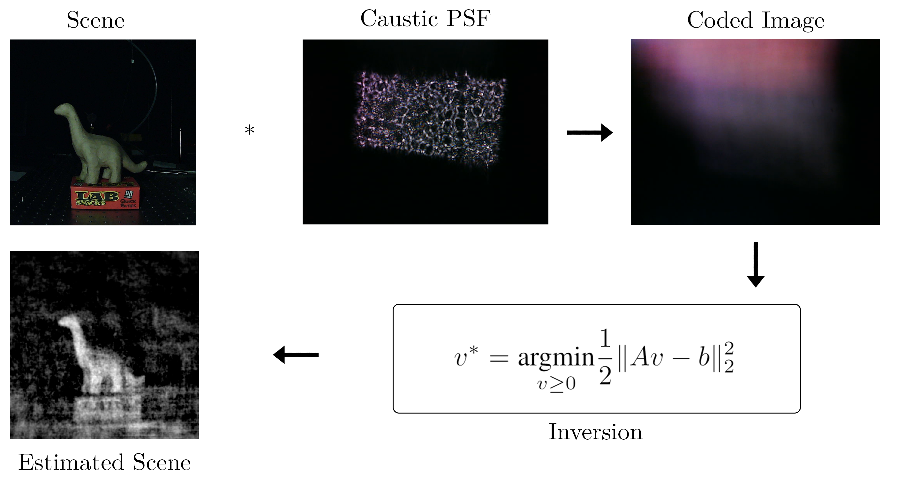

# Lensless Imaging with Caustic Mask

## Usage: 

`diffuseCam_online` for image acquisition and calibration of a diffuseCam

`diffuseCam_offline` for offline optimization and benchmarking

## Authors: 
Sean Farell

Ahmed Imtiaz

Zaid Tasneem
